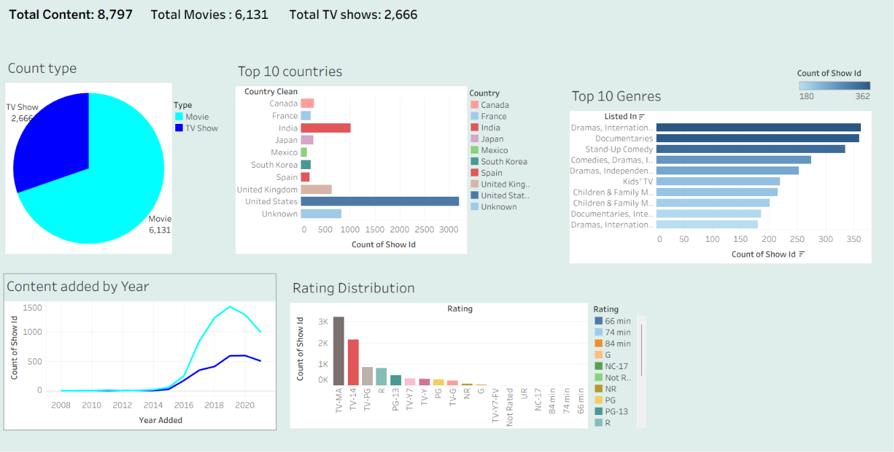

# 🎬 Netflix Content Analysis Dashboard

## 📊 Project Overview
An interactive Netflix content dashboard built using Tableau 
to analyze content distribution across countries, genres, 
ratings and years. Includes data cleaning using Python pandas.

## 🛠️ Tools Used
- Tableau (Dashboard & Visualization)
- Python (Pandas) for Data Cleaning
- SQL / SQLite (Data Analysis & Querying)
- GitHub (Portfolio)

## 🧹 Data Cleaning Steps
- Filled 831 missing country values
- Filled 2634 missing director values
- Removed 10 rows with missing dates
- Extracted year_added and month_added columns
- Cleaned country column to single country per show
- Removed duplicate titles
- Final dataset: 8,797 rows

## 📈 Dashboard Features
- KPI Tiles (Total Content, Movies, TV Shows)
- Content Type Distribution (Pie Chart)
- Top 10 Countries by Content (Bar Chart)
- Content Added by Year (Line Chart)
- Top 10 Genres (Bar Chart)
- Ratings Distribution (Bar Chart)
- Interactive Filters

## 🔍 Key Insights
- Netflix has 6,131 Movies and 2,666 TV Shows
- United States produces most content (3,000+ titles)
- Content grew massively from 2015 to 2019
- TV-MA is the most common rating
- International Dramas is the top genre

## 💻 SQL Queries
### Content Count by Type
SELECT type, COUNT(*) AS Total
FROM netflix_cleaned
GROUP BY type;

### Top 10 Countries
SELECT country_clean, COUNT(*) AS Total
FROM netflix_cleaned
GROUP BY country_clean
ORDER BY Total DESC
LIMIT 10;

### Content Added by Year
SELECT year_added, COUNT(*) AS Total
FROM netflix_cleaned
GROUP BY year_added
ORDER BY year_added;

## 📷 Dashboard Screenshot

